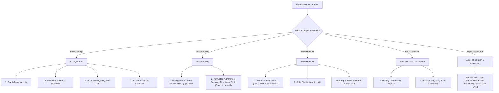

# Task Selection Guide

Selecting the appropriate evaluation metric is critical for obtaining valid, reproducible scientific conclusions. No single metric universally captures all quality dimensions across generative tasks. Applying a metric outside its theoretical assumptions produces deceptive scores and flawed model rankings.

---

## Core Principles

1. **Relative Comparison Over Absolute Cutoffs**: Never rely on arbitrary absolute thresholds (e.g. "CLIP > 30" or "LPIPS < 0.15"). Evaluate candidate models strictly against baselines under identical test sets, resolutions, and model backbones.
2. **Spatial Contract Enforcement**: Pairwise metrics (`lpips`, `ssim`, `psnr`) require strictly identical spatial dimensions ($H_{\text{ref}} = H_{\text{gen}}$, $W_{\text{ref}} = W_{\text{gen}}$). Resampling or padding changes perceptual frequency spectra and invalidates comparisons.
3. **Task Boundary Separation**: Text-to-image prompts (descriptive captions) and image editing instructions (action commands) operate in fundamentally different spaces.

---

## Evaluation Scenario Decision Tree

---

## Task-by-Task Selection Matrix

| Evaluation Scenario | Recommended Metrics | Baseline Control | Key Invariants & Protocol |
| :--- | :--- | :--- | :--- |
| **Text-to-Image (T2I)** | `clip`, `pickscore`, `aesthetic`, `fid`, `kid` | Baseline checkpoint on identical prompt benchmark (e.g. MS-COCO 30k) | Compute `clip` for objective concept presence, `pickscore` for human preference rank, and `fid`/`kid` for distribution realism. |
| **Image Editing** | `lpips`, `ssim` (for unedited/background regions) | Source image before editing | **Never** use raw `clip` directly against editing instructions. Measure pairwise retention on unedited regions. |
| **Style Transfer** | `lpips` (relative comparison), `fid`/`kid` (style domain) | Reference content image & baseline style model (e.g. AdaIN) | Expect high LPIPS due to texture alteration. Compare LPIPS increases relative to alternative models; do not use PSNR. |
| **Face & Portrait Synthesis** | `arcface`, `lpips` | Ground truth identity reference image | `arcface` cosine distance measures identity retention (lower is better); verification requires empirical benchmark calibration. |
| **Super-Resolution & Restoration** | `lpips`, `ssim`, `psnr` | High-resolution ground truth image | Strict pixel alignment required. Report all three: LPIPS (deep perceptual), SSIM (structural), and PSNR (signal-to-noise ratio). |

---

## Common Misuse Anti-Patterns

<Callout type="error">
  ### Anti-Pattern 1: Evaluating Editing Instructions with Raw CLIP

  **The Mistake**: Running `image-evaluator --metrics clip --image edited.png --prompt "make it rain"`.

  **Why It Fails**: Standard CLIP evaluates how well an image depicts a static scene description, not whether an action was performed. An image of heavy rain without the original subject may score higher on CLIP than a carefully edited image that preserves the original subject while adding rain.

  **Correct Approach**: Measure pairwise preservation (`lpips`) on source images, and use specialized directional metrics (such as Directional CLIP) to measure trajectory alignment.
</Callout>

<Callout type="error">
  ### Anti-Pattern 2: Using Single-Sample PickScore as an Absolute Win Rate

  **The Mistake**: Claiming a model has "achieved a 21.5 win rate" because an image produced a PickScore of 21.5.

  **Why It Fails**: PickScore produces unnormalized logit values. The Bradley-Terry probability is defined strictly over the sigmoid difference between two candidate images conditioned on the identical prompt: $P(A > B) = \sigma(S_A - S_B)$.

  **Correct Approach**: Rank multiple candidate outputs for the same prompt using PickScore, or compute empirical pairwise win rates across prompt distributions.
</Callout>

<Callout type="warn">
  ### Anti-Pattern 3: Treating PSNR as a Universal Metric for Generative Diffusion

  **The Mistake**: Penalizing a generative model because its PSNR is below $20\text{ dB}$.

  **Why It Fails**: PSNR computes mean squared pixel error. A 1-pixel subpixel translation or slight perceptual color grading dramatically reduces PSNR below 20 dB while the image remains visually indistinguishable.

  **Correct Approach**: Rely on deep perceptual metrics (`lpips`) for generative evaluation; reserve PSNR for pixel-aligned reconstruction tasks (codecs, denoising).
</Callout>

<Callout type="warn">
  ### Anti-Pattern 4: Overinterpreting FID on Small Sample Sizes

  **The Mistake**: Reporting FID differences between two models evaluated on only 50 or 100 images.

  **Why It Fails**: FID is a biased estimator that systematically overestimates true distribution distance when sample counts are small.

  **Correct Approach**: When sample sizes are constrained, evaluate with the unbiased **KID** metric (`--metrics kid`) alongside FID, and report standard errors across multiple subsets.
</Callout>

<Callout type="warn">
  ### Anti-Pattern 5: Comparing Aesthetic Scores Across Different Visual Domains

  **The Mistake**: Comparing an anime illustration (scoring 5.1) with a commercial photo (scoring 6.2) and concluding the anime generator is inferior.

  **Why It Fails**: Aesthetic predictor models reflect training set biases (such as photographic curation in AVA/SAC). Stylized art, minimalism, and abstract illustrations exhibit systematic distribution shifts.

  **Correct Approach**: Restrict aesthetic scoring to relative comparisons within the identical artistic domain and prompt category.
</Callout>
