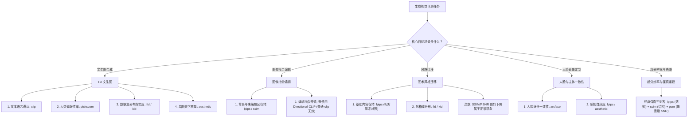

# 任务场景适用性与选择指南

在生成式图像评估中，选择契合任务数学机理的评测指标是获得科学、可复现结论的前提。不存在能够通吃所有生成任务的“通用指标”；脱离理论假设套用指标，必然会导致误导性的模型排序与虚假结论。

---

## 核心指导原则

1. **相对对照优于绝对阈值**：严禁依赖未经任务标定的绝对及格线（如所谓的 “CLIP 必须大于 30” 或 “LPIPS 低于 0.15 才是高保真”）。必须在受控的相同测试集、同分辨率、同骨干网络下，与基准模型（Baseline）进行横向相对对比。
2. **空间刚性契约约束**：成对指标（`lpips`, `ssim`, `psnr`）要求严格的像素尺寸一致性（$H_{\text{ref}} = H_{\text{gen}}$, $W_{\text{ref}} = W_{\text{gen}}$）。工具包严格执行 Fail-Fast 原则拒绝隐式重采样，防止插值模糊污染评估。
3. **任务场景边界隔离**：描述性生成提示词（如场景说明短句）与动作性编辑指令（如变换命令）在多模态特征空间中遵循完全不同的数学规律。

---

## 评测任务决策树

---

## 各任务场景指标推荐矩阵

| 评测任务场景 | 推荐指标组合 | 基线对照设计 | 关键契约与协议规范 |
| :--- | :--- | :--- | :--- |
| **文生图合成 (T2I)** | `clip`, `pickscore`, `aesthetic`, `fid`, `kid` | 同一 Prompt 基准集（如 MS-COCO 30k）上的对照模型 | 使用 `clip` 评估概念元素命中，`pickscore` 评估同 Prompt 候选图的人类偏好排序，`fid`/`kid` 评估分布真实度与多样性。 |
| **图像编辑 (Editing)** | `lpips`, `ssim` (仅限非编辑区/背景) | 编辑前的原始输入图像 | **严禁**将原始动作指令直接输入 `clip` 评测编辑图。对未修改区域使用成对指标评估保真度。 |
| **风格迁移 (Style Transfer)** | `lpips` (相对变化), `fid`/`kid` (风格分布) | 原始内容参考图及经典风格模型 (如 AdaIN) | 纹理变动必然导致 LPIPS 显著升高，需对比不同模型相对于原图的升高幅度；禁止使用 SSIM/PSNR 作为判据。 |
| **人脸/主体肖像定制** | `arcface`, `lpips` | 真实人脸身份基准图 | `arcface` 余弦距离越小表示身份保持越好；实际通过阈值必须在受控验证集上依误识率做经验标定。 |
| **超分辨率与图像重建** | `lpips`, `ssim`, `psnr` | 高分辨率真实参考图像 | 要求严格像素对齐。三维联合报告：LPIPS（深度感知）、SSIM（统计结构相似）、PSNR（像素信噪比）。 |

---

## 常见误用反面案例解析

<Callout type="error">
  ### 反面案例 1：直接使用普通 CLIP 评估图像编辑指令

  **错误做法**：执行 `image-evaluator --metrics clip --image edited.png --prompt "把草地变成雪地"`。

  **失效机理**：普通 CLIP 衡量的是图像与“描述性静态场景”的静态余弦相似度，并不衡量“动作变化的方向”。若生成器直接输出一张无原主体的高原纯雪景，其 CLIP 分数反而可能远高于完美保留原主体并局部加雪的编辑图像。

  **正确方案**：成对衡量输入原图与输出编辑图的结构保持度（`lpips`），并使用专门的 Directional CLIP 评估特征变化向量与文本变化向量的一致性。
</Callout>

<Callout type="error">
  ### 反面案例 2：将单张图片的 PickScore 当作绝对胜率

  **错误做法**：看到某张生成图的 PickScore 得分为 21.5，宣称该模型“达到了 21.5% 的人类偏好率”。

  **失效机理**：PickScore 的原生输出为未归一化的 Logit 标量。人类偏好胜率严格定义在基于相同 Prompt 的两个候选图之间的分差 Sigmoid 函数上：$P(A > B) = \sigma(S_A - S_B)$。单个绝对值不具备绝对概率含义。

  **正确方案**：在相同 Prompt 下对多张候选图片计算 PickScore 进行排序对比，或在大量评测集上统计胜率百分比。
</Callout>

<Callout type="warn">
  ### 反面案例 3：将 PSNR 作为扩散生成模型的通用及格线

  **错误做法**：因为生成模型在重构测试中的 PSNR 低于 $20\text{ dB}$，断定生成质量严重失真。

  **失效机理**：PSNR 基于像素均方误差（MSE）。图像发生 1 个亚像素平移或全局微弱色阶偏移，即可使 PSNR 骤降至 18 dB 以下，而人眼完全无法察觉任何结构破损。

  **正确方案**：生成式任务优先采用具备深度感知特性的 `lpips`；PSNR 仅用于严格像素对齐的传统编解码与超分去噪任务。
</Callout>

<Callout type="warn">
  ### 反面案例 4：在极小样本量下过度解读 FID 分值差异

  **错误做法**：在仅有 50 张测试样本的微型数据集上对比两个模型的 FID 分数，并声称某模型优于另一模型。

  **失效机理**：FID 属于有偏估计量，有限样本下的协方差估计存在连续的系统性虚高。小样本下不同采样的随机方差足以掩盖真实质量差异。

  **正确方案**：当样本量受限时，必须同步运行无偏估计量 **KID**（`--metrics kid`），并结合多次采样的均值与标准差综合判定。
</Callout>

<Callout type="warn">
  ### 反面案例 5：跨艺术画风与领域生硬对比美学分数

  **错误做法**：将二次元动漫插画（评分 5.1）与商业纪实摄影（评分 6.2）直接对比，判定动漫生成模型质量较差。

  **失效机理**：LAION Aesthetic 模型是在以写实摄影为主的 AVA/SAC 数据集上训练的，二次元、赛博朋克或抽象插画在美学特征空间中存在系统性分布偏移。

  **正确方案**：美学评分仅用于同领域、同画风之下的相对质量优劣排序与 Prompt 微调初筛。
</Callout>
